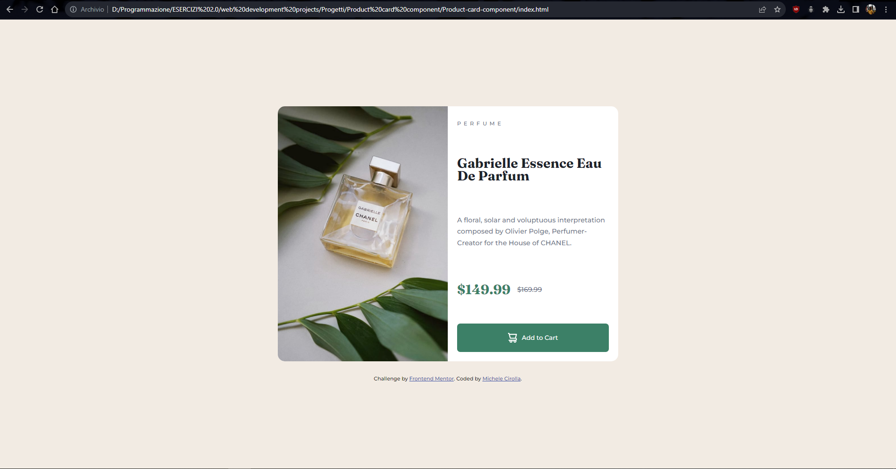

# Frontend Mentor - Product preview card component solution

This is a solution to the [Product preview card component challenge on Frontend Mentor](https://www.frontendmentor.io/challenges/product-preview-card-component-GO7UmttRfa). Frontend Mentor challenges help you improve your coding skills by building realistic projects. 

## Table of contents

- [Overview](#overview)
  - [The challenge](#the-challenge)
  - [Screenshot](#screenshot)
  - [Links](#links)
- [My process](#my-process)
  - [What I learned](#what-i-learned)
  - [Continued development](#continued-development)
  - [Useful resources](#useful-resources)
- [Author](#author)
- [Acknowledgments](#acknowledgments)

## Overview

### The challenge

Users should be able to:

- View the optimal layout depending on their device's screen size
- See hover and focus states for interactive elements

### Screenshot

### Links

- Solution URL: (https://www.frontendmentor.io/home/my-challenges?tab=completed)
- Live Site URL: (https://mikiciro.github.io/Product-card-component/)

## My process

### Built with

- Semantic HTML5 markup
- CSS custom properties
- Flexbox

### What I learned

I learned to use flexbox, media queries and image sizing on a real project starting from scratch.

This is some css code that i'm really proud:

@media screen and (min-width: 769px) {
  .container {
    flex-direction: row;
    max-width: 1200px;
    width: 729px;
    overflow: hidden;
  }

  .product-image {
    content: url("./images/image-product-desktop.jpg");
    /* impostando width al 50% l'immagine si deforma restringendosi sempre del 50% rispetto al container */
    width: 50%; 
    max-width: 600px;
    height: 100%;
    /* impostando flex-shrink a 0 nel container l'immagine rimane sempre la meta' del div .content */
    flex-shrink: 0; 
  }

  body {
    height: 100vh;
    font-size: 0.9em;
  }

  .content {
    display: flex;
    flex-direction: column;
    justify-content: space-between;
    box-sizing: border-box;
    height: 100%;
  }
}

Hope to be usefull to someone

### Continued development

I will continue to focus on the media query and the image dimensioning

## Author

- Github - [Michele Cirolla](https://github.com/Mikiciro)
- Frontend Mentor - [@Mikiciro](https://www.frontendmentor.io/profile/Mikiciro)
- Linkedin - [Michele Cirolla](https://www.linkedin.com/in/michele-cirolla-028904197/)

